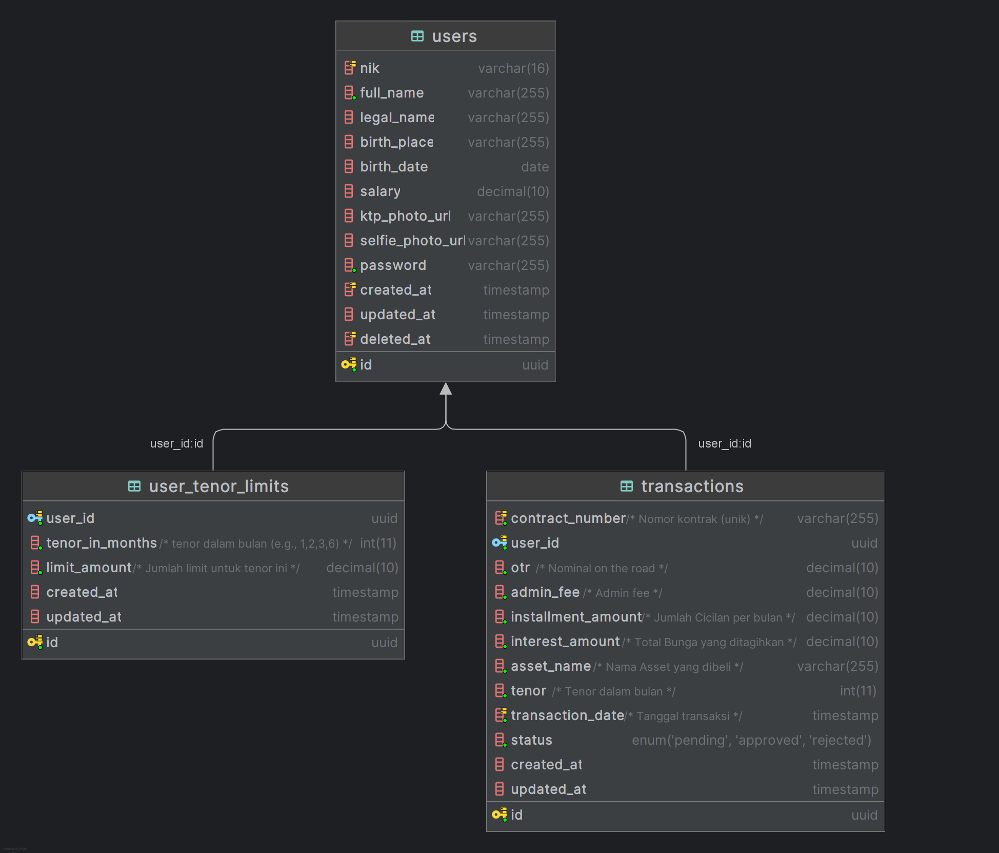

# PT XYZ Multifinance API Application

## Project Overview

This project is a backend API solution for the PT XYZ Multifinance case study, a financing company specializing in White Goods, Motorcycles, and Cars. The primary goal is to develop an IT system that is *scalable*, *maintainable*, *reliable*, *adaptable*, *secure*, and *testable* to replace the existing monolithic system. This application focuses on user data management, financing limit allocation, and credit transaction recording.

## Business Requirements

Based on the case study, this application must be able to:

* Serve 99.9% *availability customer facing system*.
* Provide *proactive action* and transparency regarding *errors*, *bugs*, *performance*, and usage.
* Provide fast and accurate *deployment* of *features/bugs*.
* Provide application security based on OWASP standards.
* Provide data that is ACID (Atomicity, Consistency, Isolation, Durability).

## Minimum Technical Requirements

1.  **Programming Language:** Golang.
2.  **Git Flow Adoption:** Code management using Git Flow.
3.  **Clean Code Architecture Adoption:** Organized and maintainable code structure.
4.  **Handling Concurrent Transactions:** Concurrent transaction handling on one of the necessary *endpoints*.
5.  **Adoption of at least 3 security attack preventions:** Based on OWASP Top 10.
6.  **Unit Test Adoption.**

## Value Add

1.  **Dockerize the built application.**

---

## Architecture Overview

This application follows a common layered architecture pattern, designed for maintainability, scalability, and observability. The core components and their interactions are as follows:

1.  **Client:** The end-users interacting with the application, typically via web or mobile interfaces.

2.  **API Gateway or Reverse Proxy:** This component acts as the single entry point for all client requests. It handles traffic routing to the backend application, load balancing, and can manage initial request filtering. While the backend application handles authentication and specific routing logic, an external API Gateway or Reverse Proxy might provide benefits like SSL termination, advanced load balancing, or a central point for cross-cutting concerns (e.g., global rate limiting).

3.  **Backend Application:** The core of the system, written in Golang, containing the main business logic, specific **routing**, and **authentication/authorization handling**. It's structured into distinct layers:
    * **Presentation Layer (Handlers):** Responsible for receiving incoming requests, performing initial input validation, handling **routing**, implementing **authentication/authorization** logic, and interacting with **Redis** for **rate limiting**. It coordinates with the service layer.
    * **Service Layer:** Encapsulates the primary business rules and logic. It orchestrates operations by interacting with the data access layer.
    * **Data Access Layer (GORM):** Manages interactions with the **MySQL database**, performing CRUD (Create, Read, Update, Delete) operations and ensuring data integrity, utilizing **GORM** as the ORM.

4.  **Redis:** An in-memory data store primarily used here for efficient **rate limiting**. The backend application communicates with Redis to track and enforce access limits for users or endpoints.

5.  **Database (MySQL):** The persistent storage for application data, including consumer information, credit limits, and transaction records.

6.  **Observability Stack:** Designed for monitoring and understanding the application's behavior in real-time.
    * **OpenTelemetry Collector:** Gathers **traces**, **metrics**, and **logs** from the backend application, processes them, and forwards them to the tracing backend.
    * **Jaeger:** A distributed tracing system that stores and visualizes **traces**, helping to troubleshoot performance issues and understand request flows across services.

### Architecture Diagram

The overall architecture can be visualized as follows:


*Note: In this architecture, while an API Gateway or Reverse Proxy might sit in front, the detailed routing and authentication are handled directly within the Backend Application. Redis is utilized for efficient rate limiting.*

---

## Database Design

The database design follows normalization principles for flexibility and data integrity. It consists of three main tables: `users`, `user_tenor_limits`, and `transactions`.

* **`users`**: Stores personal user data.
* **`user_tenor_limits`**: Stores financing limits for each tenor per user, allowing the addition of new tenors without schema changes.
* **`transactions`**: Records the details of each financing transaction, including status and a unique contract number.

Detailed database schema and relationships between tables can be seen in the Entity-Relationship Diagram (ERD) below:



---

## API Endpoints

Here are some of the main *endpoints* provided by this API:

### 1. Create New Transaction

* **Endpoint:** `POST /v1/transactions`
* **Description:** Submits a new financing transaction for a user. Performs limit validation and atomic limit reduction.
* **Request Body Example:**
    ```json
    {
        "otr": 200000.00,
        "asset_name": "Laptop",
        "tenor": 6
    }
    ```
* **Success Response (Status: `201 Created`):**
    ```json
    {
        "status": "success",
        "message": "Transaction created successfully",
        "data": {
            "id": "0196fdc1-c9c7-7061-81ad-ca2b81304a04",
            "contract_number": "TRX-20250523222737927-8177",
            "user_id": "0196f7ef-49de-79e9-b5a6-227b15de5240",
            "otr": 200000,
            "admin_fee": 2040,
            "installment_amount": 34340,
            "interest_amount": 4000,
            "asset_name": "Laptop",
            "tenor": 6,
            "transaction_date": "2025-05-23T22:27:37.927025+07:00",
            "status": "pending",
            "created_at": "2025-05-23T22:27:37.927025+07:00",
            "updated_at": "2025-05-23T22:27:37.927025+07:00"
        }
    }
    ```
* **Error Response (Status: `400 Bad Request` - Invalid Input):**
    ```json
    {
        "status": "error",
        "code": "BAD_REQUEST",
        "message": "Invalid request input.",
        "details": [
            {
                "field": "otr",
                "message": "OTR must be greater than zero."
            },
            {
                "field": "tenor",
                "message": "Tenor must be a positive integer."
            }
        ]
    }
    ```
* **Error Response (Status: `422 Unprocessable Entity` - Insufficient Limit):**
    ```json
    {
        "status": "error",
        "code": "INSUFFICIENT_LIMIT",
        "message": "Insufficient credit limit for this transaction.",
        "details": null
    }
    ```
* **Error Response (Status: `401 Unauthorized` - Authentication Failure):**
    ```json
    {
        "status": "error",
        "code": "UNAUTHORIZED",
        "message": "Missing authorization token",
        "details": null
    }
    ```
* **Error Response (Status: `500 Internal Server Error` - Server-side Issue):**
    ```json
    {
        "status": "error",
        "code": "INTERNAL_SERVER_ERROR",
        "message": "An unexpected error occurred on the server. Please try again later.",
        "details": null
    }
    ```

### 2. Get User Details

* **Endpoint:** `GET /v1/user/detail/{id}`
* **Description:** Retrieves detailed user information based on ID.
* **Success Response (Status: `200 OK`):**
    ```json
    {
        "status": "success",
        "message": "User retrieved successfully",
        "data": {
            "id": "0196f7ef-49de-79e9-b5a6-227b15de5240",
            "nik": "1234567890112345",
            "full_name": "Budi",
            "legal_name": "Budi Legal Name",
            "birth_place": "Mataram",
            "birth_date": "2000-01-01T00:00:00Z",
            "salary": 7500000,
            "ktp_photo_url": null,
            "selfie_photo_url": null,
            "created_at": "2025-05-22T12:19:36Z",
            "updated_at": "2025-05-22T12:19:36Z"
        }
  }
  ```
* **Error Response (Status: `404 Not Found`):**
    ```json
    {
        "status": "error",
        "code": "NOT_FOUND",
        "message": "user not found",
        "details": null
    }
    ```

### 3. Get User's Limits

* **Endpoint:** `GET /v1/user/tenor-limits`
* **Description:** Retrieves the available financing limits for a specific user across different tenors.
* **Success Response (Status: `200 OK`):**
    ```json
    {
        "status": "success",
        "message": "Tenor limits retrieved successfully",
        "data": [
            {
                "id": "de0f0668-7a72-4ac8-befb-b3d3de8ac857",
                "tenor_in_months": 1,
                "limit_amount": 100000,
                "created_at": "2025-05-22T19:25:15Z",
                "updated_at": "2025-05-22T19:25:15Z"
            },
            {
                "id": "fa436cc8-7539-4f57-991b-890637125bc7",
                "tenor_in_months": 2,
                "limit_amount": 200000,
                "created_at": "2025-05-22T19:25:15Z",
                "updated_at": "2025-05-22T19:25:15Z"
            },
            {
                "id": "426aadf7-7845-4783-87b5-2153eede923a",
                "tenor_in_months": 3,
                "limit_amount": 500000,
                "created_at": "2025-05-22T19:25:15Z",
                "updated_at": "2025-05-22T19:25:15Z"
            },
            {
                "id": "905b12ff-b4e7-45a3-8864-1a5514530625",
                "tenor_in_months": 6,
                "limit_amount": 700000,
                "created_at": "2025-05-22T19:25:15Z",
                "updated_at": "2025-05-22T19:25:15Z"
            }
        ]
    }
    ```
* **Error Response (Status: `401 Unauthorized` - Authentication Failure):**
    ```json
    {
        "status": "error",
        "code": "UNAUTHORIZED",
        "message": "Missing authorization token",
        "details": null
    }
    ```

### 4. Get User's Transactions

* **Endpoint:** `GET /v1/user/transactions`
* **Description:** Retrieves a paginated list of transactions initiated by a specific user.
* **Query Parameters:**
    * `page` (optional, default: 1): The page number to retrieve.
    * `limit` (optional, default: 10): The number of items per page.
* **Success Response (Status: `200 OK`):**
    ```json
    {
        "status": "success",
        "message": "Transactions retrieved successfully",
        "data": [
            {
                "id": "0196fdc1-2ba4-7a06-95c4-06d46bdf4396",
                "contract_number": "TRX-20250523222657444-9989",
                "user_id": "0196f7ef-49de-79e9-b5a6-227b15de5240",
                "otr": 400000,
                "admin_fee": 4080,
                "installment_amount": 137360,
                "interest_amount": 8000,
                "asset_name": "Motorcycle",
                "tenor": 3,
                "transaction_date": "2025-05-23T15:26:57Z",
                "status": "pending",
                "created_at": "2025-05-23T15:26:57Z",
                "updated_at": "2025-05-23T15:26:57Z"
            },
            {
                "id": "0196fdc1-c9c7-7061-81ad-ca2b81304a04",
                "contract_number": "TRX-20250523222737927-8177",
                "user_id": "0196f7ef-49de-79e9-b5a6-227b15de5240",
                "otr": 200000,
                "admin_fee": 2040,
                "installment_amount": 34340,
                "interest_amount": 4000,
                "asset_name": "Laptop",
                "tenor": 6,
                "transaction_date": "2025-05-23T15:27:37Z",
                "status": "pending",
                "created_at": "2025-05-23T15:27:37Z",
                "updated_at": "2025-05-23T15:27:37Z"
            }
        ],
        "meta": {
            "total_items": 2,
            "total_pages": 1,
            "current_page": 1,
            "per_page": 10
        }
    }
    ```
* **Error Response (Status: `401 Unauthorized` - Authentication Failure):**
    ```json
    {
        "status": "error",
        "code": "UNAUTHORIZED",
        "message": "Missing authorization token",
        "details": null
    }
    ```

---

## Concurrent Transaction Handling

On the `POST /api/v1/transactions` endpoint, concurrent transaction handling is crucial for maintaining the integrity of consumer credit limits. This is implemented using:

* **Database Transactions (GORM):** The entire operation of limit reduction and transaction recording is wrapped within a single database transaction. If any part fails, the entire transaction will be *rolled back*, ensuring atomicity.
* **Pessimistic Locking (`SELECT ... FOR UPDATE`):** When the consumer's limit is retrieved from the `consumer_tenor_limits` table for validation and reduction, that specific row is locked at the database level. This prevents other concurrent transactions from reading or modifying the same row until the current transaction is completed (either *committed* or *rolled back*).

Here is the *flowchart* for the new transaction submission process, highlighting decision points and concurrency handling:


---

## Security Attack Prevention (OWASP Top 10)

Several security prevention measures are adopted:

1.  **A03:2021 – Injection (SQL Injection):**
  * The use of **GORM** which *by default* employs *prepared statements* for all database operations, effectively preventing SQL Injection.
2.  **A07:2021 – Identification and Authentication Failures:**
  * The use of **JSON Web Tokens (JWT)** for authentication and authorization. JWTs are cryptographically signed to ensure their integrity and authenticity.
  * User identity information (e.g., `user_id`) is retrieved from the verified JWT, not from the potentially manipulable *request body*.
  * It is recommended to implement *rate limiting* on login *endpoints* to prevent *brute-force attacks*.
3.  **A04:2021 – Insecure Design (Sensitive Data Exposure):**
  * It is recommended to always use **HTTPS (TLS)** in *production deployments* to encrypt all communication between clients and the server.
  * Error messages returned to the client are general and do not disclose sensitive internal system details.

---

## Unit Testing

Unit tests are implemented to ensure the correctness of business logic and individual application components. The primary focus of unit tests is on the *service layer* which contains the core business logic, using *mocking* for database dependencies so that tests can run independently and quickly.

## How to Run the Application

### Prerequisites

* Go (version 1.20+)
* MySQL Database
* Docker (optional, for added value)

### Steps

1.  **Clone the Repository:**
    ```bash
    git clone https://github.com/putuadityabayu/kredit-plus-test
    cd kredit-plus-test
    ```

2.  **Configuration:**

    The application can be configured via `config.json`. An example configuration is provided in [`config.example.json`](./config.example.json).

    Alternatively, environment variables can be used to override specific configuration keys. Prefix environment variable names with `XYZ_`. For instance, to set `database.host`, use `export XYZ_DATABASE_HOST=127.0.0.1`.

3.  **Install Dependencies:**
    ```bash
    go mod tidy
    ```

4.  **Running OpenTelemetry And Redis:**

    It is required to run the OpenTelemetry collector and other related services (e.g., Jaeger for tracing) for observability. Navigate to the `docker` directory and start the Docker Compose services:
    ```bash
    cd docker
    docker compose -f docker-compose.deps.yml up -d
    ```
    This will spin up the necessary containers for the application's observability stack.

5.  **Database Migrations:**

    To set up or upgrade the database schema, execute the migration command:
    ```bash
    go run main.go migration upgrade
    ```
    This command will automatically create or update the necessary tables. Alternatively, you can manually run the SQL DDL script provided in the [`migrations`](./migrations) folder.

6.  **Build and Run the Application:**

    You can run the application either by building the executable or directly using `go run`. The server will operate on the port specified in your `config.json` file under the `"port"` key.

    **Option 1: Build and Execute**
    ```bash
    go build -o kredit-plus-api .
    ./kredit-plus-api server
    ```

    **Option 2: Run Directly**
    ```bash
    go run main.go server
    ```

## Dockerization (Optional)

To simplify the setup and management of all application components (redis, observability, and backend application), we use **Docker Compose** with a modular configuration. Your `docker-compose.yml` files are split into:

* **`docker/docker-compose.deps.yml`**: Defines depedencies services like the database OpenTelemetry Collector, and Jaeger.
* **`docker/docker-compose.app.yml`**: Defines your Golang backend application service.

### Steps to Run:

1.  Ensure you are in your **project's root directory**.
2.  Navigate to the `docker` folder:
    ```bash
    cd docker
    ```
3.  Run all combined services using the Docker Compose merge feature:
    ```bash
    docker compose -f docker-compose.deps.yml -f docker-compose.app.yml up -d
    ```
    This command will build your application image (if not already built) and launch all containers in the background.

### Accessing Services:

* **Backend API**: Your backend application will run on port defined in your configuration.
* **Jaeger UI**: You can access the Jaeger interface to view traces at `http://localhost:16686`.

### Stopping Services:

To stop and remove all containers started by Docker Compose:

```bash
docker compose -f docker-compose.deps.yml -f docker-compose.app.yml down
```

## Running Tests

To run the unit tests for the project, follow these steps:

1.  **Install Mock Generator:**
    ```bash
    go install github.com/golang/mock/mockgen@v1.6.0
    ```
    This tool is used to generate mock interfaces for testing purposes.

2.  **Generate Mocks:**
    ```bash
    make mock
    ```
    This command will generate necessary mock files based on your project's interfaces.

3.  **Execute Tests:**
    ```bash
    make test
    ```
    This command will run all unit tests and coverages in your project.